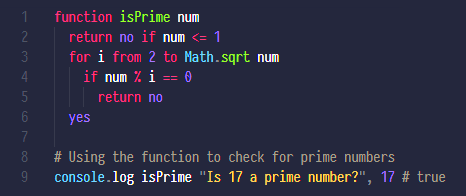

# LiveScript for Visual Studio Code

Syntax highlighting, autocomplete, and snippets support for [LiveScript](https://livescript.net), specifically [LiveScript2](https://github.com/tientq64/livescript2).

## Features

- Syntax highlighting files with extensions `.ls`, `.livescript`. Also highlights `Node.js` and a few famous library variables like `jquery`, `react`, `popperjs`, `dayjs`, `mithril.js`, `phaser`, etc.
- Autocomplete of function, class, method, and property names.
- A few snippets.

Some features are not currently supported (may be available in future versions):

- Syntax highlighting with variable names in kebab-case style.
- Syntax highlighting for `prelude.ls`.

## Changelog

[View changelog](./CHANGELOG.md)
